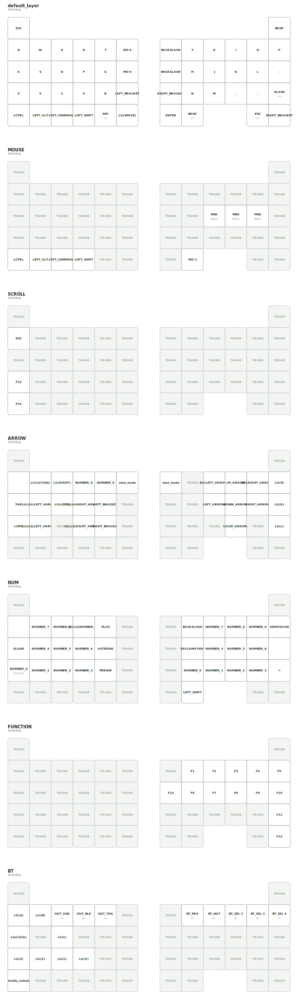

## description
- このキーボードは無線分割式 50% 19mm スライドロータリー トラックボール内蔵のキーボードになります。

## ビルドガイド
- ビルドガイド
  - 作成中

- 購入後のセットアップ
  - https://frequent-breeze-833.notion.site/LoTom-2ace518048a380438cd8c65c32c07ce9

## スペック
- ファームウェア
  - ZMK を使用しています
  - ZMKStudio および DYAStudio に対応しております
- ハードウェア
  - 48 キー
  - choc v2、lofree 系列のスイッチが使用可能
  - 右手側が central,左手側が peripheral になります
  - 両手に OLED 内蔵
  - 左手にサイドにスライドロータリーを２つ内蔵
    - デフォルトでは左がマウススクロール、下側がタブ切り替えになっております
  - 右手にサイドにスライドロータリーを1つ内蔵
    - デフォルトでは左がマウススクロール
  - トラックボール19mm
    - ケースごとマグネットで張り付いているので、脱着可能です
  - 単4電池対応 2 つ必要です

## キーマップについて

- DYAStudioにて確認・編集を行なってください
  - https://studio.dya.cormoran.works/

- ZMK keymap-editor も使用できます
  - マクロ設定などを使いたい場合はこちらを使うとべんりです
  - https://nickcoutsos.github.io/keymap-editor
  - ご使用の時は本リポジトリをフォークしてお使いください
    - ※フォークしてマクロ等にパスワードなどを設定する際はリポジトリが public になってしまい情報漏洩につながりますのでご注意ください

### キーマップ図

キーマップを変更すると、GitHub Actions により以下の図も自動更新されます。

### レイヤー

- レイヤー 0 がデフォルトです
- レイヤー 1 がオートマウスレイヤーです
  - トラックボール操作中に切り替わるレイヤーです(400ms でレイヤー０に切り替わります)
  - デフォルトのトラックボールのcpiは600cpiです
- レイヤー 2 がトラックボール時のスクロールレイヤーです
- レイヤー 6は主にBTペアリング用のレイヤーになっています

## その他

不明な点がある場合は下記アカウントにご連絡ください
https://x.com/tomcat09131
